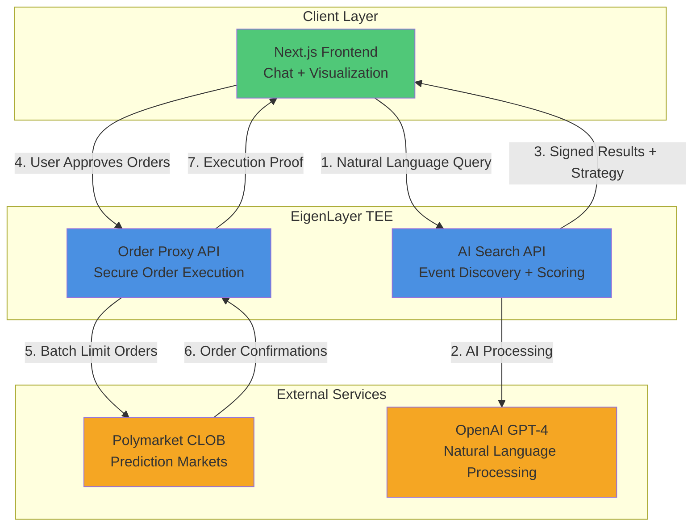
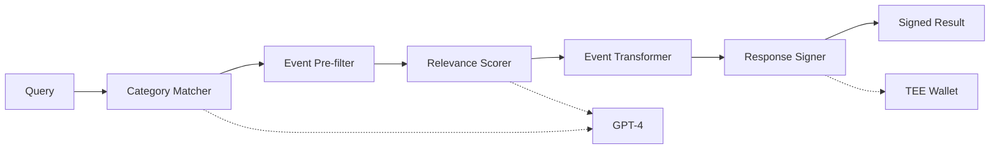
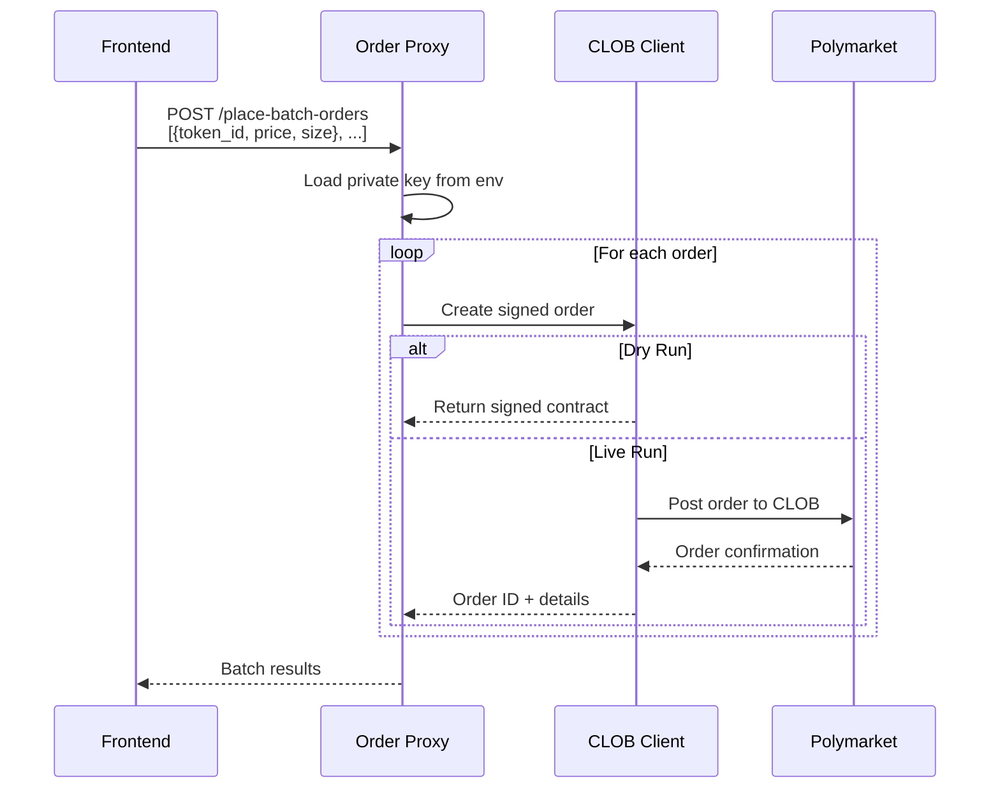
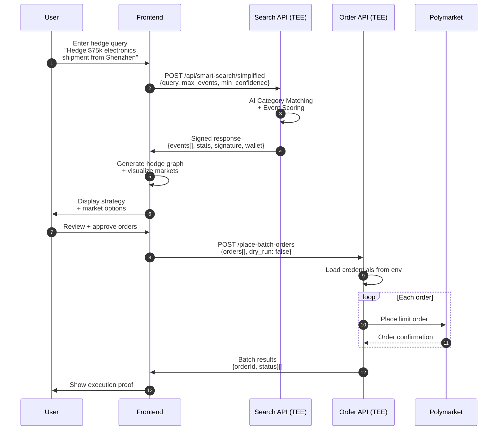
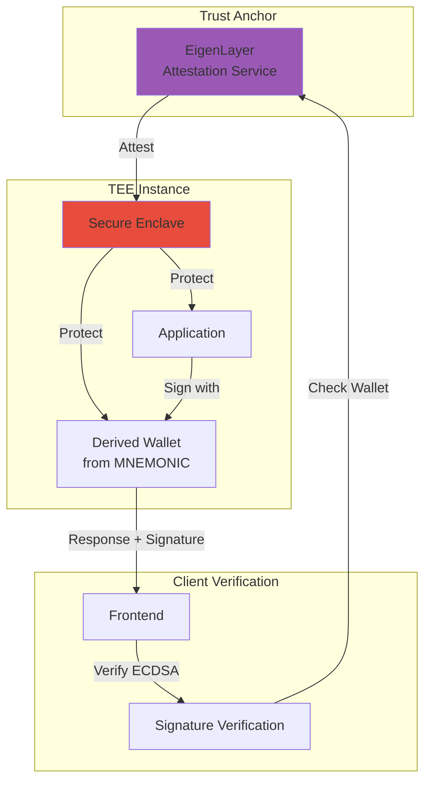

# PolyHedg

AI-powered prediction market hedging platform using EigenLayer TEE for verifiable computation and secure order execution.

## Architecture Overview



## System Components

### Frontend (`polyhedg-frontend/`)
**Stack:** Next.js 14, React, TypeScript, Tailwind CSS, React Flow  
**Purpose:** User interface for hedge creation, visualization, and management

**Key Features:**
- Natural language hedge input via chat interface
- Interactive hedge graph visualization with React Flow
- Real-time market data display
- Sidebar navigation for hedge portfolio management
- Client-side hedge session management

**Tech Highlights:**
- Server-side rendering with Next.js App Router
- Type-safe API routes for backend proxying
- Responsive design with Tailwind CSS
- Component-based architecture

### AI Search API (`polyhedg-polymarket-api/`)
**Stack:** FastAPI, Python 3.11+, OpenAI GPT-4, Docker, Caddy  
**Purpose:** AI-powered event discovery and relevance scoring with TEE verification

**Key Features:**
- **Natural Language Category Matching:** Maps user queries to Polymarket categories using GPT-4
- **Smart Event Filtering:** Pre-filters 50k+ events by category before AI scoring
- **Relevance Scoring:** Assigns 0-100 relevance scores with explanations
- **Response Signing:** Cryptographically signs results with TEE wallet for verifiability
- **TLS Termination:** Caddy reverse proxy with automatic HTTPS

**Architecture:**


**Data Flow:**
1. Parse user query and extract search parameters
2. Use GPT-4 to match relevant Polymarket categories (e.g., "bitcoin" → ["Crypto", "Bitcoin"])
3. Pre-filter events from static dataset by matched categories
4. Score filtered events with GPT-4 (relevance + reasoning)
5. Transform events to frontend format
6. Sign response with TEE-derived wallet (ECDSA)
7. Return signed data with signature, wallet address, timestamp

### Order Proxy API (`polymarket-purchase-api/`)
**Stack:** FastAPI, Python 3.11+, py-clob-client  
**Purpose:** Secure proxy for placing batch orders on Polymarket without exposing private keys

**Key Features:**
- **Batch Processing:** Accept multiple orders in single request
- **Dry Run Mode:** Generate signed order contracts without posting
- **Live Mode:** Execute orders on Polymarket CLOB
- **Credential Isolation:** Private keys stored as environment variables, never exposed to client

**Order Flow:**


### EigenLayer TEE Deployment (`eigen-tee/`)
**Stack:** Python 3.11+, Caddy, Docker, EigenX CLI  
**Purpose:** Trusted execution environment wrapper for TEE deployment

**Key Features:**
- Automatic TLS certificate management via Let's Encrypt
- Encrypted persistent storage for keys and certificates
- Docker-based deployment with EigenX CLI
- Domain configuration for public access
- Health monitoring and logging

## Data Flow

### Complete Hedging Flow


## Security Model

### TEE Verification Chain


### Key Security Features

**Search API:**
- Responses signed with deterministic wallet derived from `MNEMONIC`
- ECDSA signature over JSON response (lexicographically sorted keys)
- Includes timestamp and wallet address in signature payload
- TLS encryption via Caddy for all transport

**Order API:**
- Private keys stored as environment variables, never logged or transmitted
- No client-side key exposure
- Orders signed server-side before posting to Polymarket
- Rate limiting and authentication (recommended for production)

**TEE Guarantees:**
- Code and data encrypted at rest
- Memory encrypted during execution
- Remote attestation via EigenLayer
- Persistent encrypted storage for secrets

## Deployment

### Prerequisites
- Docker & Docker Hub account
- EigenX CLI: `npm install -g @eigenlayer/cli`
- ETH for gas (Sepolia testnet or mainnet)
- OpenAI API key
- Polymarket credentials (private key + funder address)

### Deploy Search API to TEE
```bash
cd polyhedg-polymarket-api

# Set environment variables
export OPENAI_API_KEY="sk-..."
export MNEMONIC="your twelve word mnemonic phrase"
export DOMAIN="your-domain.com"

# Build and push Docker image
docker build -t yourusername/polyhedg-search-api .
docker push yourusername/polyhedg-search-api

# Deploy to EigenLayer
eigenx auth generate --store
eigenx app configure tls  # Configure domain
eigenx app deploy yourusername/polyhedg-search-api

# Get deployment info
eigenx app info polyhedg-search-api
eigenx app logs polyhedg-search-api
```

### Deploy Order API to TEE
```bash
cd polymarket-purchase-api

# Set environment variables
export POLYMARKET_PRIVATE_KEY="0x..."
export POLYMARKET_FUNDER="0x..."

# Build and deploy
docker build -t yourusername/polyhedg-order-api .
docker push yourusername/polyhedg-order-api
eigenx app deploy yourusername/polyhedg-order-api
```

### Deploy Frontend
```bash
cd polyhedg-frontend

# Update API endpoints in src/app/api/smart-search/route.ts
# Point to your TEE deployment URLs

# Deploy to Cloudflare Pages
npm install
npm run build
npx wrangler pages deploy .next
```

## API Endpoints

### Search API
```
POST /api/smart-search/simplified
Body: {
  query: string,
  max_total_events: number,
  min_confidence: number,
  enable_ai_scoring: boolean
}
Response: {
  data: { events: Event[], stats: Stats },
  signature: string,
  wallet: string,
  timestamp: string
}
```

### Order API
```
POST /place-batch-orders
Body: {
  orders: [{ token_id: string, price: number, size: number }],
  dry_run: boolean
}
Response: {
  batch_results: [{
    status: string,
    input_order: Order,
    polymarket_response: { orderId: string }
  }]
}
```

## Development

### Local Development
```bash
# Frontend
cd polyhedg-frontend
npm install
npm run dev  # http://localhost:3000

# Search API
cd polyhedg-polymarket-api
pip install -r requirements.txt
cp .env.example .env  # Add OPENAI_API_KEY
python -m app.main    # http://localhost:80

# Order API
cd polymarket-purchase-api
pip install -r requirements.txt
export POLYMARKET_PRIVATE_KEY="0x..."
export POLYMARKET_FUNDER="0x..."
uvicorn main:app --reload --port 8000
```

### Tech Stack Summary
| Component | Languages | Frameworks | Key Dependencies |
|-----------|-----------|------------|------------------|
| Frontend | TypeScript, React | Next.js 14 | React Flow, Tailwind CSS |
| Search API | Python 3.11+ | FastAPI | OpenAI SDK, eth-account |
| Order API | Python 3.11+ | FastAPI | py-clob-client |
| TEE | Docker | Caddy | EigenX CLI |

## Project Structure
```
polyhedg/
├── polyhedg-frontend/          # Next.js web application
│   ├── src/app/                # App router pages
│   │   ├── [hedgeName]/        # Dynamic hedge detail pages
│   │   └── api/                # API route handlers
│   └── src/components/         # React components
├── polyhedg-polymarket-api/    # AI search + TEE signing
│   ├── app/
│   │   ├── services/           # Business logic modules
│   │   └── prompts/            # LLM system prompts
│   ├── data/res/               # Static event data
│   ├── Dockerfile              # Container definition
│   └── Caddyfile               # TLS configuration
├── polymarket-purchase-api/    # Order execution proxy
│   ├── main.py                 # FastAPI application
│   └── requirements.txt        # Python dependencies
├── eigen-tee/                  # TEE deployment wrapper
│   ├── Dockerfile              # Base TEE container
│   └── Caddyfile               # TLS proxy config
└── docs/                       # Documentation + research
```

## License
MIT

